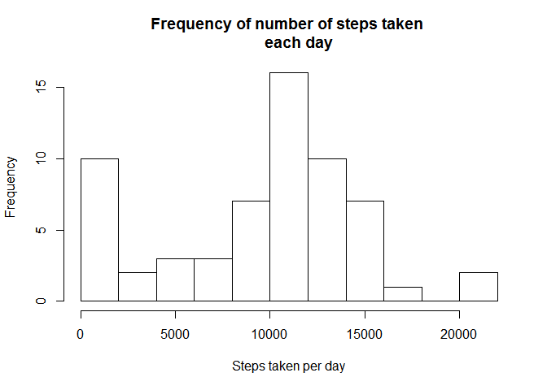
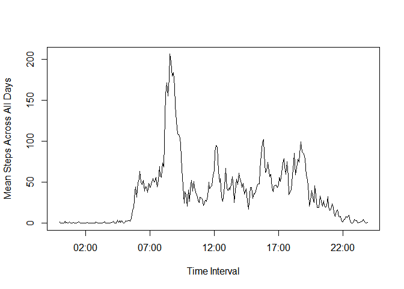
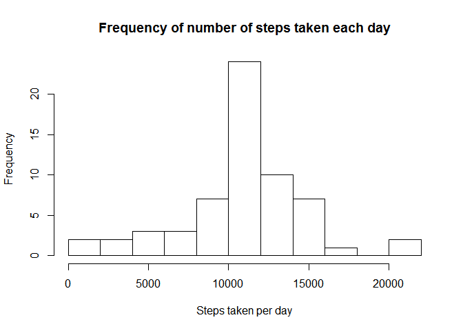
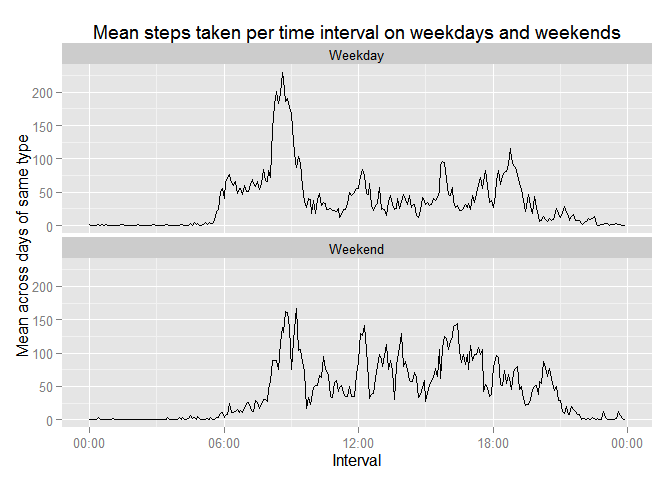

# Reproducible Research: Peer Assessment 1

## Loading and preprocessing the data

First, load the required libraries. Then, unzip the data set(activity.zip) if 
activity.csv doesn't already exist, and read that in to R as a dataframe.

```r
library(plyr)
library(dplyr)
```

```
## 
## Attaching package: 'dplyr'
## 
## The following objects are masked from 'package:plyr':
## 
##     arrange, count, desc, failwith, id, mutate, rename, summarise,
##     summarize
## 
## The following object is masked from 'package:stats':
## 
##     filter
## 
## The following objects are masked from 'package:base':
## 
##     intersect, setdiff, setequal, union
```

```r
library(lubridate)
```

```
## 
## Attaching package: 'lubridate'
## 
## The following object is masked from 'package:plyr':
## 
##     here
```

```r
library(ggplot2)
library(scales)
if (!file.exists('activity.csv')) {
    unzip('activity.zip')
}
data <- read.csv('activity.csv')
by_date <- summarize(group_by(data, date), total_steps = sum(steps, na.rm = TRUE))
```

## What is the mean total number of steps taken per day?

The data collected result in the following histogram:

```r
hist(by_date$total_steps, breaks = 10, main = "Frequency of number of steps taken 
     each day", xlab = "Steps taken per day")
```

 

The mean number of steps taken per day is:

```r
mean(by_date$total_steps, na.rm = TRUE)
```

```
## [1] 9354.23
```

The median number of steps per day is:

```r
median(by_date$total_steps, na.rm = TRUE)
```

```
## [1] 10395
```

## What is the average daily activity pattern?

Mutate the interval column to require column's data to have 4 digits (add leading 0s),
then add another column with which contains the date/time information.

```r
data <- mutate(data, interval = sprintf("%04d", interval)) %>% 
    mutate(time = parse_date_time(paste(date, interval, sep = " "), "ymdR*"))
```

Create a summary of data that consists of the mean of the number of steps taken 
by interval. Plot the time series of 5-minute intervals vs. the average for the 
particular interval across all days.

```r
by_interval <- summarize(group_by(data, interval), mean_steps_by_interval = 
                             mean(steps, na.rm = TRUE))
plot(parse_date_time(by_interval$interval, "R*"), by_interval$mean_steps_by_interval, type = "l",
     xlab = "Time Interval", ylab = "Mean Steps Across All Days")
```

 

From the plot, it appears that on average, the most daily activity occurs
between 8 and 9 AM, with additional spikes around noon (lunchtime), and between
4 and 6 PM. The maximum average daily activity is:

The maximum average daily activity occurs at the following interval and with the 
following average number of steps:

```r
by_interval[which.max(by_interval$mean_steps_by_interval), 1:2]
```

```
## Source: local data frame [1 x 2]
## 
##   interval mean_steps_by_interval
## 1     0835               206.1698
```


## Imputing missing values

First, the number of missing values is:

```r
sum(is.na(data$steps))
```

```
## [1] 2304
```

To replace these NA values, let's replace the NA with the mean number steps 
found at the particular time interval.

```r
impute.mean <- function(x) replace(x, is.na(x), mean(x, na.rm = TRUE))
data_corrected <- ddply(data, ~ interval, transform, steps = impute.mean(steps))
data_corrected <- data_corrected[order(data_corrected$date, data_corrected$interval), ]
```

The histogram containing the corrected data set appears as follows:

```r
by_date_corrected <- summarize(group_by(data_corrected, date), total_steps = sum(steps, na.rm = TRUE))
hist(by_date_corrected$total_steps, breaks = 10, main = "Frequency of number of steps taken each day",
     xlab = "Steps taken per day")
```

 

The mean number of steps taken per day with the corrected dataset is:

```r
mean(by_date_corrected$total_steps, na.rm = TRUE)
```

```
## [1] 10766.19
```

The median number of steps per day with the corrected dataset is:

```r
median(by_date_corrected$total_steps, na.rm = TRUE)
```

```
## [1] 10766.19
```

## Are there differences in activity patterns between weekdays and weekends?

Add a factor to the corrected dataframe which identifies weekdays vs. weekends.

```r
day_type <- data.frame("day_of_week" = c(1,2,3,4,5,6,7), 
                       "type_day" = c("Weekend", "Weekday", "Weekday", "Weekday", 
                                      "Weekday", "Weekday", "Weekend"))
data_corrected <- mutate(data_corrected, day_of_week = wday(data_corrected$date)) %>%
    left_join(day_type)
```

```
## Joining by: "day_of_week"
```

Create a summary of the corrected interval dataframe, grouped by type of day and 
interval. The results are then plotted to show how activity patterns change
between weekdays and weekends.

```r
    by_interval_corrected <- summarize(group_by(data_corrected, type_day, interval), 
                                       mean_steps = mean(steps))
    g <- ggplot(by_interval_corrected, 
                aes(x = parse_date_time(interval, "R*"), y = mean_steps),
                facets = type_day)
    g + geom_line() + facet_wrap( ~ type_day, nrow = 2, ncol = 1) + 
        ggtitle("Mean steps taken per time interval on weekdays and weekends") +
        xlab("Interval") + ylab("Mean across days of same type") + scale_x_datetime(labels = date_format("%R"))
```

 

As is shown in the graphs, there are higher spikes in movement at certain times
of the day on weekdays, whereas activity is lower and more spread out on weekends.
